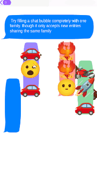

# SMS Curiosities

An endless arcade puzzle mobile game, cycling through varying popular mobile puzzle genres under the same unified architecture, in form of
SMS emojis dragged around text bubbles.


<p align="center">
  
</p>

---

## Overview

A modular Unity puzzle framework, built to demonstrate that a wide range of commercially-recognizable mobile puzzle genres can be expressed as different configurations of the same small set of systems, rather than implemented one by one as separate minigames.

Six commercially-recognizable puzzle genres: Water Sort, Block Puzzle, Merge, Toon Blast, Tile Connect and Parking Jam currently run on one shared architecture instead of five separate codebases. Each is expressed as a different composition of the same handful of systems (layout, constraints, completion predicates, resolutions), with its own procedural generator and its own way of guaranteeing the result is actually solvable. Currently, five of them have been fully implemented.

The project demonstrates reusable architecture, procedural generation with correctness guarantees, and certain compromises/deviations to better fit the original games with the project's unified model.


---

## Implemented Puzzle Genres

| Genre | Container / Layout | Constraint | Completion | Generation approach |
|---|---|---|---|---|
| Water Sort | Region-grown tubes | Capacity + same-group entry | Tube full | Quota-matched supply |
| Merge (2048-style) | Per-tile cell | Occupant interaction (merge on match) | Target tier reached | Seeded so the target tier is always reachable |
| Toon Blast (match-3) | Per-tile cell, optional layering | Occupant interaction (swap-to-match) | Board cleared | Quota-matched groups |
| Tile Connect (Onet-style) | Per-tile cell, no direct entry | Reachability (routed connection) | Board cleared | Reverse construction (build backward from a solved state) |
| Parking Jam (arrow-maze) | None | Escape-lane clearance | Every piece escaped | Greedy monotone solvability check |


---

## Gameplay Features

- **Modular architecture**: a puzzle genre is a composition of shared pieces (layout strategy, constraints, completion predicate, resolution), not bespoke per-genre code.
- **Seven puzzle genres, one pipeline**: every genre above runs through the same `BaseZone` generate → validate → commit flow.
- **Solvability-guaranteed procedural generation**: quota-matched supply, reverse construction, and greedy monotone verification, chosen per genre rather than forced through one generic solver.
- **Layering**: a cell can hold several stacked tokens; clearing the visible one reveals whatever's buried underneath.
- **Game flow & difficulty scaling**: a persistent flow manager drives Menu → Playing → Win/Lose → Retry/Next Level, with each zone's board size and spawn counts scaling off a single shared difficulty knob.
- **Animated, themed tokens**: tokens play hover/drag flipbook animations via Unity's Playables API, resolved per group and per merge tier.
- **Tweened feedback**: a small custom coroutine-based tween system drives pickup pops, merge convergence, buried-token reveals, and clear cascades.

---

## Tech Stack

- **Engine:** Unity (2D, URP)
- **Language:** C#
- **Rendering:** Unity Playables API (`AnimationClipPlayable`) for hand-driven, non-legacy sprite animation
- **Input:** uGUI `EventSystem`, unifying mouse and touch drag through one code path

---

## Project Structure

```
Assets/Scripts/
  Layout/
    Token.cs               # Draggable manipulable entity; per-genre placement resolution
    TokenSpawner.cs         # Spawning, animation resolution, footprint placement
    Container.cs            # Constraint/predicate/resolution bundle; layering (buried tokens)
    ContainerRules.cs        # Concrete constraints, predicates, resolutions, occupant interactions
    ContainerManager.cs      # Container registration, lookup, shared generation utilities
    ContainerLayout.cs       # Reusable layout strategies (per-tile, orthogonal, region-growth)
    Grid.cs                  # Pure geometry: coordinate conversion, occupancy, bench reservation
  Zone Variants/
    BaseZone.cs              # Shared generation pipeline, win/lose detection, difficulty scaling
    WaterSortBaseZone.cs
    BlockPuzzleBaseZone.cs
    MergeBaseZone.cs
    ToonBlastBaseZone.cs
    TileConnectBaseZone.cs
    ParkingJamBaseZone.cs
  Visuals/
    TweenRunner.cs            # Coroutine-based tween utility
    MergeEffect.cs
    ConnectPathEffect.cs
  GameFlowManager.cs         # Menu/Playing/Won/Lost state, difficulty progression, scene reload
  GameFlowUI.cs              # Flow-state -> panel visibility wiring
  GameState.cs               # Global color/group palette
  Spawner.cs                 # Zone selection/cycling for the current build
```

---

## Controls

| Input | Action |
|---|---|
| Click/tap + drag | Move a token |
| Release over a valid slot | Attempt placement, match, or merge |
| R | Cycle to the next puzzle genre (development build) |

---
